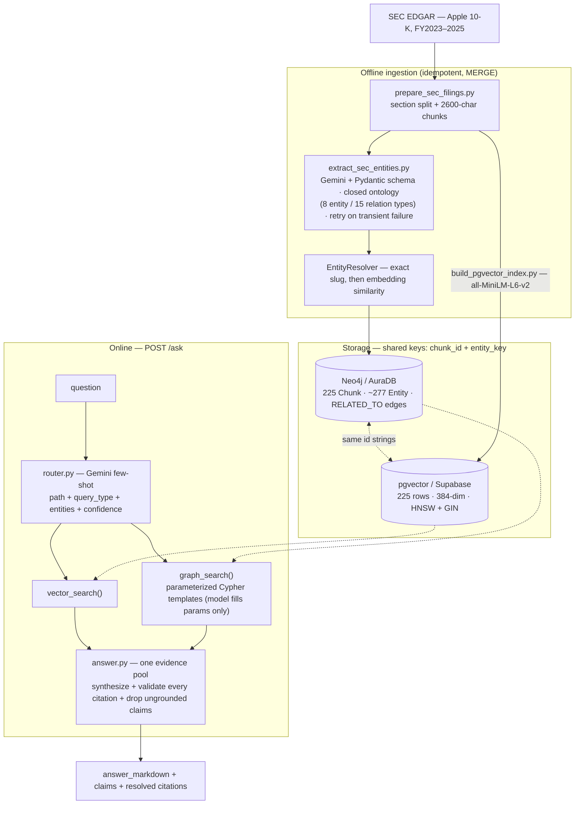

# Knowledge Graph RAG Engine

Hybrid knowledge-graph + vector RAG over SEC filings (Apple 10-Ks, FY2023–2025). It routes
each question to graph retrieval (Neo4j), vector retrieval (pgvector), or both, merges the
results into one answer, and validates every citation against a chunk that was actually
retrieved. On a 53-question benchmark it scores **0.85 vs. 0.68** for a plain vector-RAG
baseline — **+17 points**, with the gap concentrated on the questions a graph is for.

## Benchmark

Hybrid answerer vs. the same answerer forced to a vector-only path. 53 hand-labeled
questions, graded by a deterministic fact checklist (`scripts/benchmark.py`), no LLM judge.
Model: `gemini-3.1-flash-lite` (free tier).

| Question type | n | Vector-only | Hybrid | Δ |
|---|--:|--:|--:|--:|
| single-hop | 18 | 0.94 | 0.89 | −0.05 |
| two-hop | 12 | 0.67 | 0.75 | +0.08 |
| three-hop | 6 | 1.00 | 1.00 | ±0.00 |
| aggregation (tally over relationships) | 9 | 0.56 | 0.67 | +0.11 |
| out-of-scope (correctly refused) | 8 | 0.00 | 1.00 | **+1.00** |
| **overall** | 53 | **0.68** | **0.85** | **+0.17** |

- **Latency** (model + retrieval, free-tier pacing excluded): vector-only p50 6.4 s / p95 9.4 s ·
  hybrid p50 8.5 s / p95 19.8 s — the router call + graph traversal + a larger context block.
- **Cost per 1,000 queries** (modelled at $0.10 / $0.40 per 1M tokens; **$0 actual** on the
  free tier): vector-only $0.49 · hybrid **$1.25** — the hybrid uses ~2.8× the tokens
  (graph facts + passages in one context).
- **One-time graph ingestion**: ~225 Gemini extraction calls ($0 on the free tier), local
  CPU embeddings, free Neo4j + pgvector loads.

Full data: [`data/eval/results/benchmark_20260901T114932Z.json`](data/eval/results/).

### Honest read

**The graph pays off on relationship questions and refusal, at a real cost in latency and
tokens.** Where it helps, and how much:

- **Out-of-scope refusal (+1.00).** A plain vector RAG has no mechanism to decline — it
  answered all 8 unanswerable questions confidently and wrongly. The hybrid router
  classifies them and refuses. This is the single largest contributor to the overall gap.
- **Aggregation over relationships (+0.11).** Questions like "which laws is Apple subject
  to?" or "in which regions does it operate?" — the graph's `SUBJECT_TO` / `LOCATED_IN`
  tallies surface entities that a single retrieved passage misses (q026, q035).
- **Multi-hop (+0.08 two-hop, ±0 three-hop).** Real but noisy at n = 6–12; the model is
  not deterministic, so a stratum can swing by a question between runs. A second run put
  two-hop at +0.17.
- **Single-hop (−0.05).** One question, noise.

Where it doesn't help: the graph having a fact doesn't guarantee the answer uses it —
q025 ("compare Apple's named competitors across years") routes to `graph`, the
`COMPETES_WITH` edges are right there, and the model still answered "the filings don't
name specific competitors." And retrieval recall (≈0.5 with MiniLM-384 embeddings) is the
ceiling for *both* systems — the DMA compliance date, the contractual-obligations table
and the risk-factor category headings miss on both.

## Architecture



The `graph` route also runs `vector_search()` — graph facts are terse one-liners, so the
source passages give the synthesizer full context. Graph facts *augment* the text.

## Design decisions

- **Local embeddings, not an API.** `sentence-transformers` (`all-MiniLM-L6-v2`) on CPU —
  free, no quota. Trade-off: 384-dim is weaker than a paid model, and it's the accuracy
  ceiling here.
- **The model never writes Cypher.** The router returns a `query_type` enum that selects a
  fixed, parameterized Cypher template; the model only fills entity names.
- **Citations are validated, not trusted.** The answerer re-prompts while any claim cites a
  non-retrieved chunk, then drops the claim (`tests/test_answer.py`).
- **Deterministic grading, not an LLM judge.** A fact checklist is reproducible; every
  `wrong` / `partial` was reviewed by hand (and two over-strict gold entries corrected).
- **Baseline = the same answerer, forced to the vector path.** Isolates one variable —
  graph vs. no graph; synthesis and citation validation are byte-identical on both.

## What didn't work / limitations

- **Run-to-run variance is real** at these sample sizes — a hop-count stratum can move by a
  question between runs on the same set. The overall +0.17 and the +1.00 on refusal are
  stable; the two/three-hop deltas are not tight.
- **The graph having a fact ≠ the answer using it** (q025 — competitor comparison routes to
  the graph, the edges exist, the model still punts).
- **Retrieval recall ≈ 0.5** is the ceiling for both systems (MiniLM-384, 2,600-char chunks).
- **`section_name` was silently wrong for a whole section.** The chunker's heading list
  omitted ~13 of 22 10-K items, and the Item 7 regex required an apostrophe `extract_text`
  strips — so all of MD&A was labeled "Item 3. Legal Proceedings". Fixed in place
  (`scripts/fix_chunk_sections.py`), no re-chunk.
- **The system doesn't push back on loaded questions** ("how much was Apple *unauthorized*
  to repurchase?" → gets the authorized amount). Presupposition checking is out of scope.
- **`ef_search` tuning was a non-event** — recall flat across 32→400 at this corpus size.
- **Latency and cost are modelled**, not measured on a paid deployment. The project's
  original model (`gemini-3.5-flash-lite`) was retired mid-build; switched to
  `gemini-3.1-flash-lite`.

## Phases

Built in order — see [`docs/PROJECT_GOAL_AND_PHASES.md`](docs/PROJECT_GOAL_AND_PHASES.md):

1. Entities + relationships into Neo4j — closed ontology, two-tier entity resolution, `MERGE`.
2. pgvector index over the same chunks — HNSW, recall@k measured.
3. Question router — few-shot → enum, parameterized Cypher templates. Routes 18/18
   multi-hop benchmark questions to graph or both; 96.3% on the Phase 3 gate set.
4. Merge graph + vector → one grounded, cited answer; `POST /ask` with citation validation.
5. This benchmark.

## Stack

Python · Neo4j / Cypher (AuraDB) · PostgreSQL + pgvector (Supabase) · `sentence-transformers`
local embeddings · Gemini API (extraction + routing + synthesis) · FastAPI · plain Python,
no LangChain. Rationale: [`docs/TECH_STACK.md`](docs/TECH_STACK.md).

## Setup & usage

```
pip install -r requirements.txt
pip install -e .
cp .env.example .env      # Neo4j + Supabase + Gemini credentials

uvicorn kgrag.api:app
curl -s -XPOST localhost:8000/ask -H 'content-type: application/json' \
     -d '{"question":"How is Apple connected to the European Union through regulation?"}'

python -m kgrag.answer "Which regulations is Apple subject to?"     # CLI
python -m kgrag.answer "..." --vector-only                           # baseline path
python scripts/benchmark.py --limit 6                                # smoke the benchmark
```

## Docs

- [`docs/PROJECT_GOAL_AND_PHASES.md`](docs/PROJECT_GOAL_AND_PHASES.md) — goal + 5-phase plan
- [`docs/TECH_STACK.md`](docs/TECH_STACK.md) — every tool and why
- [`docs/LIVING_SPECS.md`](docs/LIVING_SPECS.md) — current build state
- [`docs/WHAT_WE_DID_AND_WHY.md`](docs/WHAT_WE_DID_AND_WHY.md) — decision log
