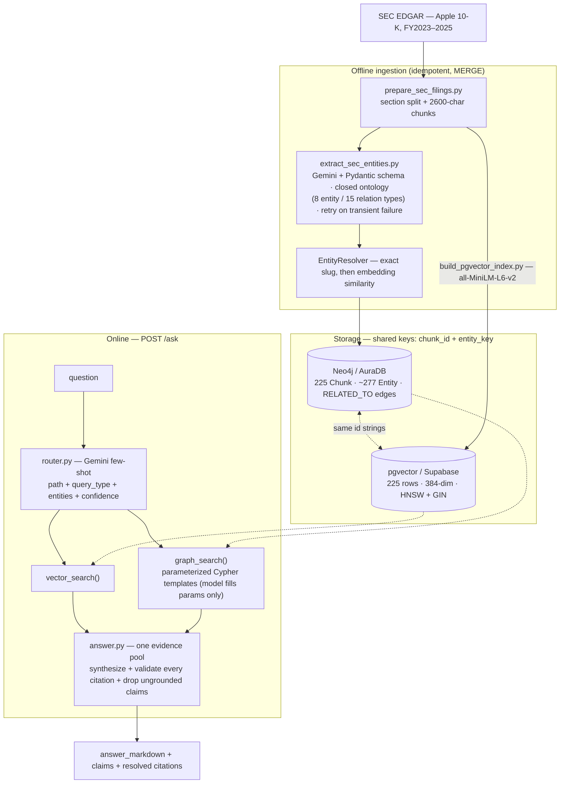

# Knowledge Graph RAG Engine

Hybrid knowledge-graph + vector RAG over SEC filings (Apple 10-Ks, FY2023–2025). It routes
each question to graph retrieval (Neo4j), vector retrieval (pgvector), or both, merges the
results into one answer, and validates every citation against a chunk that was actually
retrieved. On a 53-question benchmark it scores **0.83 vs. 0.68** for a plain vector-RAG
baseline — a **+15-point** gain that comes almost entirely from knowing when to refuse.

## Benchmark

Hybrid answerer vs. the same answerer forced to a vector-only path. 53 hand-labeled
questions, graded by a deterministic fact checklist (`scripts/benchmark.py`), no LLM judge.

| Question type | n | Vector-only | Hybrid | Δ |
|---|--:|--:|--:|--:|
| single-hop | 18 | 0.94 | 0.89 | −0.05 |
| two-hop | 12 | 0.83 | 0.92 | +0.08 |
| three-hop | 6 | 0.67 | 0.67 | ±0.00 |
| aggregation | 9 | 0.56 | 0.56 | ±0.00 |
| out-of-scope (correctly refused) | 8 | 0.00 | 1.00 | **+1.00** |
| **overall** | 53 | **0.68** | **0.83** | **+0.15** |

- **Latency** (model + retrieval, free-tier pacing excluded): vector-only p50 5.2 s / p95 7.6 s ·
  hybrid p50 6.3 s / p95 13.2 s — the router and graph traversal add a hop.
- **Cost per 1,000 queries** (modelled at $0.10 / $0.40 per 1M tokens; **$0 actual** on the
  Gemini free tier): vector-only $0.54 · hybrid $0.85.
- **One-time graph ingestion**: ~225 Gemini extraction calls ($0 on the free tier), local
  CPU embeddings, free Neo4j + pgvector loads.

Full data: [`data/eval/results/benchmark_20260901T094727Z.json`](data/eval/results/).

### Honest read

**The graph does not measurably improve in-scope answer accuracy on this corpus.** On
single/two/three-hop and aggregation questions the two systems are within one question of
each other per stratum — noise at these sample sizes. The spec expects "a widening gap as
hops increase"; we get near-parity.

**The entire +15-point gain is refusal handling.** A plain vector RAG has no mechanism to
decline — it answered all 8 out-of-scope questions confidently and wrongly (0/8). The
hybrid system's router classifies them as out-of-scope and refuses (8/8).

Why the graph underperforms expectations: the corpus is one company, so the graph is thin —
only ~4 of the original 27 questions genuinely need entity traversal, and `SUPPLIES` was
extracted zero times and dropped from the ontology. The real accuracy ceiling is
**retrieval** (recall@5 ≈ 0.5 with MiniLM-384 embeddings): most remaining misses on *both*
systems are the retriever not surfacing the right chunk (the DMA compliance date, the
contractual-obligations table, the risk-factor category headings). The graph even hurt once —
q019, an App Store legal question the router sent to graph-only, returned commission-structure
facts and missed the Epic Games narrative the vector path nailed.

## Architecture



## Design decisions

- **Local embeddings, not an API.** `sentence-transformers` (`all-MiniLM-L6-v2`) on CPU —
  free, no quota. Trade-off: 384-dim is weaker than a paid model, and it's the accuracy
  ceiling here.
- **The model never writes Cypher.** The router returns a `query_type` enum that selects a
  fixed, parameterized Cypher template; the model only fills entity names. Security control
  and reproducibility.
- **Citations are validated, not trusted.** The answerer re-prompts while any claim cites a
  non-retrieved chunk, then drops the claim. The answer can never cite a chunk that wasn't
  retrieved (`tests/test_answer.py`).
- **Deterministic grading, not an LLM judge.** The calibrated judge is a separate project; a
  fact checklist is reproducible, and honest that it's strict on phrasing (every `wrong` /
  `partial` was reviewed by hand).
- **Baseline = the same answerer, forced to the vector path.** Isolates one variable —
  graph vs. no graph; synthesis and citation validation are byte-identical on both.

## What didn't work / limitations

- **A single-company corpus makes a thin graph** — the graph doesn't move in-scope answer
  accuracy (see "Honest read").
- **`section_name` was silently wrong for a whole section.** The chunker's heading list
  omitted ~13 of 22 10-K items, and the Item 7 regex required an apostrophe `extract_text`
  strips — so all of MD&A was labeled "Item 3. Legal Proceedings". Caught only when Phase 4
  printed it in a citation. Fixed in place (`scripts/fix_chunk_sections.py`), no re-chunk.
- **The system doesn't push back on loaded questions.** "How much was Apple *unauthorized* to
  repurchase?" gets the *authorized* amount — the retriever keyword-matches, the generator
  over-helps. Presupposition checking is out of scope.
- **`ef_search` tuning was a non-event** — swept 32→400 + exact ceiling, recall flat at this
  corpus size. Documented, not hidden.
- **Latency and cost are modelled**, not measured on a paid deployment.
- **53 questions** is the low end of the spec's 50–100 — directional, not statistically tight.

## Phases

Built in order — see [`docs/PROJECT_GOAL_AND_PHASES.md`](docs/PROJECT_GOAL_AND_PHASES.md):

1. Entities + relationships into Neo4j — closed ontology, two-tier entity resolution, `MERGE`.
2. pgvector index over the same chunks — HNSW, recall@k measured (hit@5 0.90 on the Phase 2 set).
3. Question router — few-shot → enum, parameterized Cypher templates. Routing accuracy
   **96.3%** on the Phase 3 gate set (borderline cases), **53/53** on the full benchmark set.
4. Merge graph + vector → one grounded, cited answer; `POST /ask` with citation validation.
5. This benchmark.

## Stack

Python · Neo4j / Cypher (AuraDB) · PostgreSQL + pgvector (Supabase) · `sentence-transformers`
local embeddings · Gemini API (extraction + routing + synthesis) · FastAPI · plain Python,
no LangChain. Rationale: [`docs/TECH_STACK.md`](docs/TECH_STACK.md).

## Setup & usage

```
pip install -r requirements.txt
pip install -e .
cp .env.example .env      # Neo4j + Supabase + Gemini credentials

uvicorn kgrag.api:app
curl -s -XPOST localhost:8000/ask -H 'content-type: application/json' \
     -d '{"question":"What is the Epic Games lawsuit against Apple about?"}'

python -m kgrag.answer "Which regulations is Apple subject to?"     # CLI
python -m kgrag.answer "..." --vector-only                           # baseline path
python scripts/benchmark.py --limit 6                                # smoke the benchmark
```

## Docs

- [`docs/PROJECT_GOAL_AND_PHASES.md`](docs/PROJECT_GOAL_AND_PHASES.md) — goal + 5-phase plan
- [`docs/TECH_STACK.md`](docs/TECH_STACK.md) — every tool and why
- [`docs/LIVING_SPECS.md`](docs/LIVING_SPECS.md) — current build state
- [`docs/WHAT_WE_DID_AND_WHY.md`](docs/WHAT_WE_DID_AND_WHY.md) — decision log
